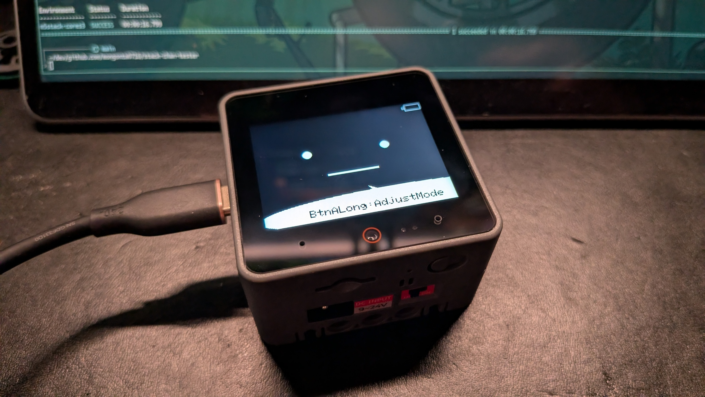
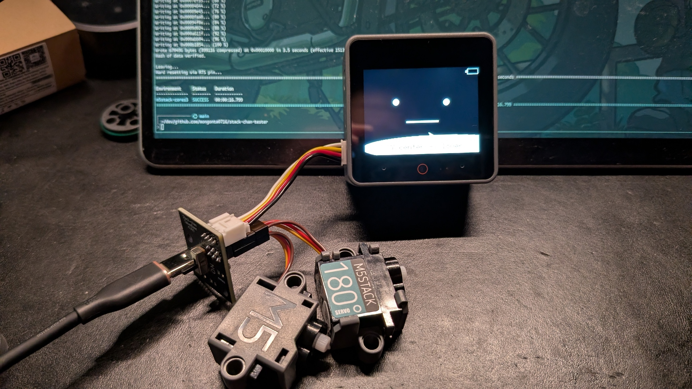
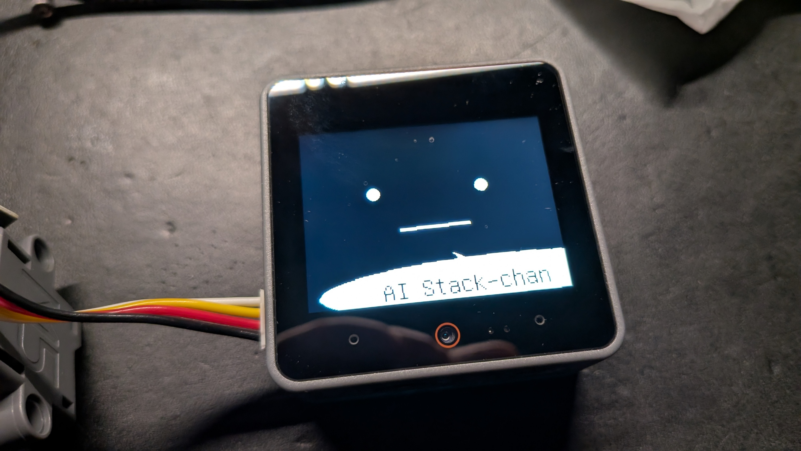

# ｽﾀｯｸﾁｬﾝ ビルドログ

## 用意したもの

- [M5Stack CoreS3](https://docs.m5stack.com/ja/core/CoreS3)
- [Servo Kit 180°](https://docs.m5stack.com/ja/accessory/servo_kit) x2
- [Grove Cable (5cm)](https://docs.m5stack.com/ja/accessory/cable/grove_cable)
- [M5GO Bottom3](https://docs.m5stack.com/ja/module/M5GO3%20Bottom)
- [Stack-chan_Takao_Base](https://www.switch-science.com/products/8905)
- microSDHC 32GB (アキヨドで買おうとしたら 1 万くらいしてビビったので急遽知り合いに恵んでもらった)

## 開発環境

Windows 11 / WSL 2 (Ubuntu) で実施します。

### PlatformIO Core CLI

<https://platformio.org/install/cli>

`pio` で CoreS3 にファームウェアをアップロードします。

今回は Nix / home-manager でインストールしてます。

### usbipd-win

<https://learn.microsoft.com/ja-jp/windows/wsl/connect-usb>

WSL 2 上で USB デバイスを接続する為のツールです。

Windows 側に winget をつかってインストールします。

```powershell
winget install usbipd
```

## 手順

### CoreS3 を WSL 2 に接続する

usbipd で USB を WSL 2 にアタッチします。

```bash
usbipd.exe list                           # CoreS3 の BUSID を確認
sudo.exe usbipd.exe bind --busid <BUSID>  # 初回のみ
usbipd.exe attach --wsl --busid <BUSID>   # WSL 2 にアタッチ
ls /dev/ttyACM*                           # または /dev/ttyUSB* で認識確認
```

```bash
> usbipd.exe list
Connected:
BUSID  VID:PID    DEVICE                                                        STATE
5-3    303a:1001  USB シリアル デバイス (COM3), USB JTAG/serial debug unit      Not shared
```

今回は BUSID は `5-3` でした。

```bash
> sudo.exe usbipd.exe bind --busid 5-3
```

```bash
> usbipd.exe attach --wsl --busid 5-3
```

```bash
> ls /dev/ttyACM*
/dev/ttyACM0
```

`/dev/ttyACM0` にアタッチできました。

### CoreS3 にテスト用のファームウェアを書き込む

今回は [mongonta0716/stack-chan-tester](https://github.com/mongonta0716/stack-chan-tester) を使わせてもらいます。

任意の場所に clone しビルドします。

```bash
pio run -e m5stack-cores3
```

書き込みします。

```bash
pio run -e m5stack-cores3 -t upload --upload-port /dev/ttyACM0
```

> [!INFO]
>
> もしも書き込みできない場合は、リセットボタンを 3 秒間押し続けて、ダウンロードモード(緑の LED が点滅している状態)にしてから書き込みます。

できました。 CoreS3 にお顔が表示されます。



### サーボを動かす

Takao_Base と Servo Kit 180° を接続してサーボを動かします。

1. Grove Cable を使って CoreS3 の Port.A (USB-C 端子の右の赤いとこ)と Takao_Base を接続
2. Servo Kit 180° のサーボ 2 つを Takao_Base に接続

- H1 端子: 水平方向(足側)のサーボ
- V2 端子: 上下方向(筐体側)のサーボ
- GND 側(サーボの配線の色は茶色)を合わせる

3. Takao_Base の USB-C に給電

CoreS3 のディスプレイ下部左から A / B / C ボタンとなっています。B ボタン(中央)をタッチするとサーボが動きだします。



### AI Stack-chan Ex のビルドと書き込み

[ronron-gh/AI_StackChan_Ex](https://github.com/ronron-gh/AI_StackChan_Ex) を使わせてもらいます。

任意の場所に clone しビルドします。

```bash
cd ./firmware
pio run -e m5stack-cores3
```

書き込みします。

> [!INFO]
>
> もしも USB を取り外ししていた場合は、先に `usbipd` のアタッチが必要です。

```bash
pio run -e m5stack-cores3 -t upload --upload-port /dev/ttyACM0
```

### microSD の用意

まずはフォーマットします。

> [!CAUTION]
>
> microSD 内のデータは削除されます。

PowerShell 上で以下を実行します。

```powershell
# まず microSD のドライブレターを確認。
Get-Volume

# FAT32 でフォーマット (例: D ドライブの場合)
Format-Volume -DriveLetter D -FileSystem FAT32 -NewFileSystemLabel "STACKCHAN"
```

フォーマットできました。

```powershell
> Get-Volume D

DriveLetter FriendlyName FileSystemType DriveType HealthStatus OperationalStatus SizeRemaining     Size
----------- ------------ -------------- --------- ------------ ----------------- -------------     ----
D           STACKCHAN    FAT32          Removable Healthy      OK                     28.77 GB 28.77 GB
```

そしたら `ronron-gh/AI_StackChan_Ex` 配下の `Copy-to-SD` の各種値を書き換えます。

```diff:Copy-to-SD/app/AiStackChanEx/SC_ExConfig.yaml
--- a/Copy-to-SD/app/AiStackChanEx/SC_ExConfig.yaml
+++ b/Copy-to-SD/app/AiStackChanEx/SC_ExConfig.yaml
@@ -4,18 +4,18 @@ llm:
   type: 0                            # 0:ChatGPT  1:ModuleLLM  2:ModuleLLM(Function Calling)

 tts:
-  type: 0                            # 0:VOICEVOX  1:ElevenLabs  2:OpenAI TTS  3:AquesTalk 4:ModuleLLM
-  model: ""                          # VOICEVOX, AquesTalk (modelは未対応)
+  type: 2                            # 0:VOICEVOX  1:ElevenLabs  2:OpenAI TTS  3:AquesTalk 4:ModuleLLM
+  model: "tts-1"                     # OpenAI TTS
+  #model: ""                          # VOICEVOX, AquesTalk (modelは未対応)
   #model: "eleven_multilingual_v2"    # ElevenLabs
-  #model: "tts-1"                     # OpenAI TTS
   #model: "melotts-ja-jp"             # ModuleLLM (日本語)  ※モデル指定なしの場合は英語
-  voice: "3"                         # VOICEVOX (ずんだもん)
+  voice: "alloy"                     # OpenAI TTS
+  #voice: "3"                         # VOICEVOX (ずんだもん)
   #voice: "AZnzlk1XvdvUeBnXmlld"      # ElevenLabs
-  #voice: "alloy"                     # OpenAI TTS
   #voice: ""                          # AquesTalk, ModuleLLM (voiceは未対応)

 stt:
-  type: 0                            # 0:Google STT  1:OpenAI Whisper  2:ModuleLLM(ASR)  3:ModuleLLM(Whisper)
+  type: 1                            # 0:Google STT  1:OpenAI Whisper  2:ModuleLLM(ASR)  3:ModuleLLM(Whisper)

 wakeword:
   type: 0                            # 0:SimpleVox  1:ModuleLLM(KWS)
```

今回は OpenAI の TTS / STT(Whisper) をつかいます。

```diff:Copy-to-SD/yaml/SC_BasicConfig.yaml
--- a/Copy-to-SD/yaml/SC_BasicConfig.yaml
+++ b/Copy-to-SD/yaml/SC_BasicConfig.yaml
@@ -6,8 +6,8 @@ servo:
     # CoreS3 PortA X:1,Y:2 PortB X:8,Y:9 PortC X:18,Y:17
     # Stack-chanPCB Core1 X:5,Y:2 Core2 X:19,Y27
     # When using SCS0009, x:RX, y:TX (not used).(StackchanRT Version:Core1 x16,y17, Core2: x13,y14)
-    x: 33
-    y: 32
+    x: 1
+    y: 2
   center:
     x: 90
     y: 90
@@ -44,6 +44,6 @@ balloon:
   - "Je suis Stack-chan"
 led_lr: 0 # 0:stereo, 1:left_only, 2:right_only
 led_pin: 15 # GoBottom1:15 GoBottom2:25
-takao_base: false # Whether to use takaobase to feed power from the rear connector.(Stack-chan_Takao_Base  https://ssci.to/8905)
+takao_base: true # Whether to use takaobase to feed power from the rear connector.(Stack-chan_Takao_Base  https://ssci.to/8905)
 servo_type: "PWM" # "PWM": SG90PWMServo, "SCS": Feetech SCS0009
 secret_config_show: true                               # Whether personal information is output to the log or not.
```

CoreS3 の Port.A にあわせてサーボピンの番号を変更します。

```diff:Copy-to-SD/yaml/SC_SecConfig.yaml
--- a/Copy-to-SD/yaml/SC_SecConfig.yaml
+++ b/Copy-to-SD/yaml/SC_SecConfig.yaml
@@ -1,10 +1,10 @@
 # 個人情報用の設定ファイル
 wifi:
-  ssid: "********"
-  password: "********"
+  ssid: "********"
+  password: "********"


 apikey:
-  stt: "********"       # ApiKey of SpeechToText Service
-  aiservice: "********" # ApiKey of AIService
-  tts: "********"       # ApiKey of TextToSpeech Service
+  stt: "sk-****"       # ApiKey of SpeechToText Service
+  aiservice: "sk-****" # ApiKey of AIService
+  tts: "sk-****"       # ApiKey of TextToSpeech Service
```

Wi-Fi (2.4 GHz) と OpenAI の API キーを設定します。

これらを microSD に書き込みます。

```powershell
Copy-Item -Recurse -Force \\wsl$\Ubuntu\path\to\ronron-gh\AI_StackChan_Ex\Copy-to-SD\* D:\
```

### 起動

ついでなのでこのタイミングで M5GO Bottom3 も繋げます。

起動し、OpenAI TTS / Whisper をつかった音声応答ができれば成功です。よかったですね。


